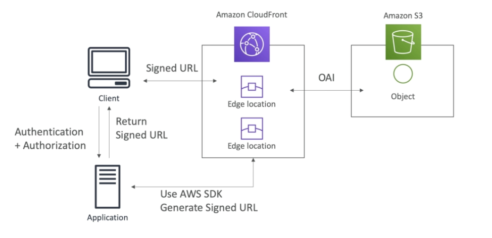

# CloudFront

Created By: Keishin CHOU
Last Edited: Apr 21, 2020 9:43 PM

### Overview

- Content Delivery Network (CDN)
- Improve read performance, content is cached at the edge.
- You can restrict who can access your distribution using a whitelist or blacklist.
- Edge Location
    - Location where content will be cached. Separate to an AWS Region / AZ.
    - Not READ only, you can **WRITE** to Edge Location too.
- Origin
    - The origin of all the files that the CDN will distribute.
    - Can be a S3 bucket, an EC2 instance, an Elastic Load Balancer, or Route 53.
- Distribution
    - A collection of Edge Locations.
- You can clear cached objects, but you will be charged.

### CloudFront vs S3 Cross Region Replication

- CloudFront
    - Global Edge Network
    - Files are cached for a TTL
    - Great for static content that need to be available everywhere
- S3 CRR
    - Must be set up for each region you want replication to happen
    - Files are updated in near real-time
    - Read only
    - Great for dynamic content that needs to be available at low latency in few regions.

### Restrict Bucket Access

- If RBA is enabled, user cannot access S3 URLs, but only using the CloudFront URLs.
- Useful when using signed URLs

### CloudFront Invalidation

- User can add paths to invalidate the objects in this path from CloudFront distribution.

### CloudFront Signed URL / Signed Cookies

- Signed URL: access to a individual file (one URL per file)
- Signed cookies: access to multiple files (one cookie for many files)
- Includes URL expiration
- Includes IP ranges to access the data
- Only trusted AWS account can create signed URLs

### CloudFront Signed URL vs S3 Pre-Signed URL

- CloudFront Signed URL
    - Allow access to a path, no matter the origin.
    - Account wide key-pair, only the root can manage it.
    - Can filter by IP, path, date, expiration.
    - Can leverage caching features.
- S3 Pre-Signed URL
    - Issue a request as the people who pre-signed the URL.
    - Use the IAM key of the signing IAM principal.
    - Limited lifetime.