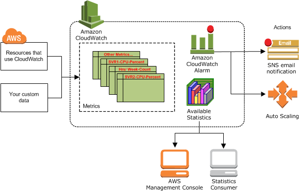

# CloudWatch

Created By: Keishin CHOU
Last Edited: Apr 28, 2020 10:43 AM

### Overview

- Amazon CloudWatch monitors your AWS resources and the applications you run on AWS in real time. You can use CloudWatch to collect and track metrics, which are variables you can measure for your resources and applications.
- The CloudWatch home page automatically displays metrics about every AWS service you use. You can additionally create `custom dashboards` to display metrics about your custom applications, and display custom collections of metrics that you choose.
- You can create alarms which watch metrics and send notifications or automatically make changes to the resources you are monitoring when a threshold is breached.

    

    - For default metrics, every 5 minutes, you can set to 1 minute with Detailed Monitoring.
    - For custom metrics, every 1 minute, you can set to 1 second with High Resolution Custom Metrics.

### Concepts

- Namespaces
    - A *namespace* is a container for CloudWatch metrics. Metrics in different namespaces are isolated from each other, so that metrics from different applications are not mistakenly aggregated into the same statistics.
    - There is no default namespace. You must specify a namespace for each data point you publish to CloudWatch.
- Metrics
    - Metrics are the fundamental concept in CloudWatch. A metric represents a time-ordered set of data points that are published to CloudWatch.

### CloudWatch Dashboards

- Dashboards are global.
- Dashboards can include graphs from different regions.

### CloudWatch Logs

- Applications can send logs to CloudWatch using SDK.
- CloudWatch logs can go to
    - Batch exporter to S3 for archival.
    - Stream to ElasticSearch cluster for further analytics.
- You can define a log expiration policy.

### CloudWatch Alarms

- Metric alarm
    - A *metric alarm* watches a single CloudWatch metric or the result of a math expression based on CloudWatch metrics. The alarm performs one or more actions based on the value of the metric or expression relative to a threshold over a number of time periods. The action can be an Amazon EC2 action, an Amazon EC2 Auto Scaling action, or a notification sent to an Amazon SNS topic.
- Composite alarm
    - A *composite alarm* includes a rule expression that takes into account the alarm states of other alarms that you have created. The composite alarm goes into ALARM state only if all conditions of the rule are met. The alarms specified in a composite alarm's rule expression can include metric alarms and other composite alarms.
    - Using composite alarms can reduce alarm noise. You can create multiple metric alarms, and also create a composite alarm and set up alerts only for the composite alarm. For example, a composite might go into ALARM state only when all of the underlying metric alarms are in ALARM state.
    - Composite alarms can send Amazon SNS notifications when they change state, but cannot perform EC2 actions or Auto Scaling actions.
- Period
    - Length of time in seconds to evaluate the metric.
    - High Resolution Custom Metrics: can only choose 10 seconds or 30 seconds.

### CloudWatch Events

-