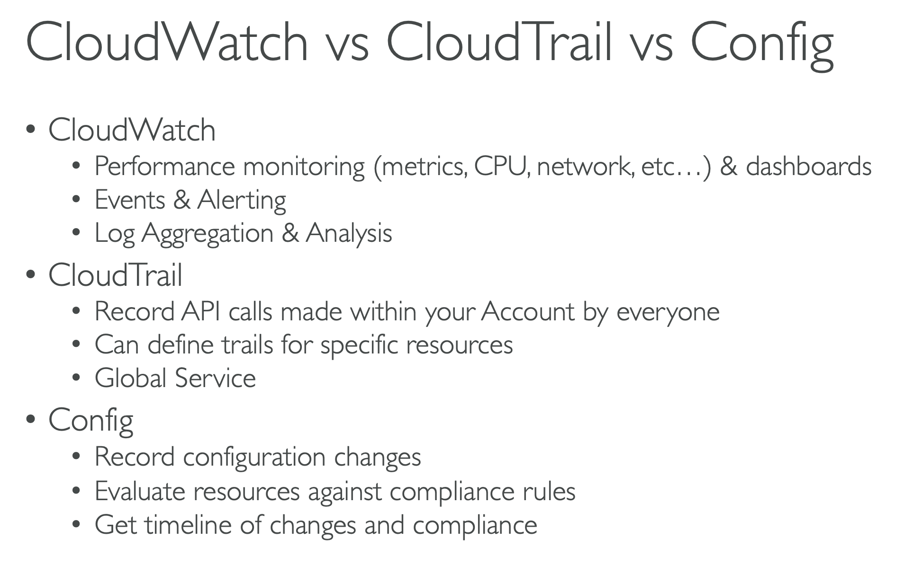

# Config

Created By: Keishin CHOU
Last Edited: Apr 28, 2020 10:58 AM

### Overview

- AWS Config provides a detailed view of the configuration of AWS resources in your AWS account. This includes how the resources are related to one another and how they were configured in the past so that you can see how the configurations and relationships change over time.
- With AWS Config, you can do the following:
    - Evaluate your AWS resource configurations for desired settings.
    - Get a snapshot of the current configurations of the supported resources that are associated with your AWS account.
    - Retrieve configurations of one or more resources that exist in your account.
    - Retrieve historical configurations of one or more resources.
    - Receive a notification whenever a resource is created, modified, or deleted.
    - View relationships between resources. For example, you might want to find all resources that use a particular security group.

### CloudWatch vs CloudTrail vs Config

[AWS - Difference between CloudWatch and CloudTrail](https://medium.com/awesome-cloud/aws-difference-between-cloudwatch-and-cloudtrail-16a486f8bc95)