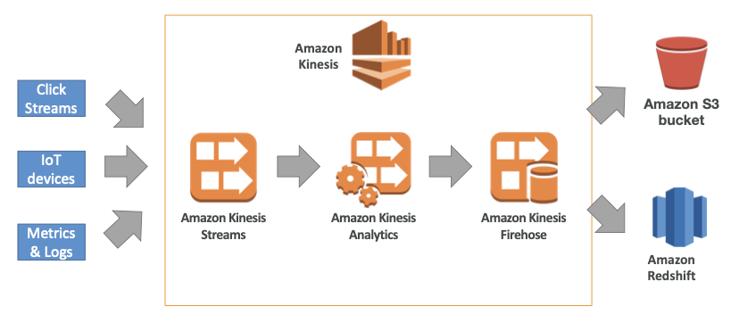

# Kinesis

Created By: Keishin CHOU
Last Edited: Apr 24, 2020 10:39 PM

### Overview

- Kinesis Data Stream
    - Amazon Kinesis Data Streams is used to collect and process large streams of data records in real time.
- Kinesis Data Firehose
    - Amazon Kinesis Data Firehose is a fully managed service for delivering real-time streaming data to destinations such as `Amazon S3`, `Amazon Redshift`, `Amazon Elasticsearch Service (Amazon ES)`, and `Splunk`.
- Kinesis Data Analytics
    - With Amazon Kinesis Data Analytics for SQL Applications, you can process and analyze streaming data using standard SQL. The service enables you to quickly author and run powerful SQL code against streaming sources to perform time series analytics, feed real-time dashboards, and create real-time metrics.

### Kinesis Data Stream

- A Kinesis data stream is a set of shards. Each shard has a sequence of data records. Each data record has a sequence number that is assigned by Kinesis Data Streams.
- Data Record
    - A data record is the unit of data stored in a Kinesis data stream. Data records are composed of a sequence number, a partition key, and a data blob, which is an immutable sequence of bytes. Kinesis Data Streams does not inspect, interpret, or change the data in the blob in any way. A data blob can be up to 1 MB.
    - Records are ordered per shard.
- Retention Period
    - The retention period is the length of time that data records are accessible after they are added to the stream. A stream’s retention period is set to a default of 24 hours after creation.
    - You can increase the retention period up to 168 hours (7 days) using the `IncreaseStreamRetentionPeriod` operation, and decrease the retention period down to a minimum of 24 hours using the `DecreaseStreamRetentionPeriod` operation.
    - Additional charges apply for streams with a retention period set to more than 24 hours.
- Shard
    - A *shard* is a uniquely identified sequence of data records in a stream. A stream is composed of one or more shards, each of which provides a fixed unit of capacity. Each shard can support up to 5 transactions per second for reads, up to a maximum total data read rate of 2 MB per second and up to 1,000 records per second for writes, up to a maximum total data write rate of 1 MB per second (including partition keys). The data capacity of your stream is a function of the number of shards that you specify for the stream. The total capacity of the stream is the sum of the capacities of its shards.
    - If your data rate increases, you can increase or decrease the number of shards allocated to your stream.

### Kinesis Data Firehose

- Amazon Kinesis Data Firehose is a fully managed service for delivering real-time streaming data to destinations such as Amazon Simple Storage Service (Amazon S3), Amazon Redshift, Amazon Elasticsearch Service (Amazon ES), and Splunk.
- Feature
    - Kinesis Data Firehose delivery stream
        - The underlying entity of Kinesis Data Firehose. You use Kinesis Data Firehose by creating a Kinesis Data Firehose delivery stream and then sending data to it.
    - Record
        - The data of interest that your data producer sends to a Kinesis Data Firehose delivery stream. A record can be as large as 1,000 KB.
    - Data producer
        - Producers send records to Kinesis Data Firehose delivery streams. For example, a web server that sends log data to a delivery stream is a data producer.
        - You can also configure your Kinesis Data Firehose delivery stream to automatically read data from an existing Kinesis data stream, and load it into destinations.
    - Buffer size and buffer interval
        - Kinesis Data Firehose buffers incoming streaming data to a certain size or for a certain period of time before delivering it to destinations. Buffer Size is in MBs and Buffer Interval is in seconds.
- Data Flow
    - S3
        - For Amazon S3 destinations, streaming data is delivered to your S3 bucket. If data transformation is enabled, you can optionally back up source data to another Amazon S3 bucket.

        

    - Amazon Redshift
        - For Amazon Redshift destinations, streaming data is delivered to your S3 bucket first. Kinesis Data Firehose then issues an Amazon Redshift **COPY** command to load data from your S3 bucket to your Amazon Redshift cluster. If data transformation is enabled, you can optionally back up source data to another Amazon S3 bucket.

        

    - Amazon ES
        - For Amazon ES destinations, streaming data is delivered to your Amazon ES cluster, and it can optionally be backed up to your S3 bucket concurrently.

        

    - Splunk
        - For Splunk destinations, streaming data is delivered to Splunk, and it can optionally be backed up to your S3 bucket concurrently.

        

### Kinesis Data Stream vs Kinesis Data Firehose

- Stream
    - You need to write custom code for producer and consumer.
    - Real time (~200ms).
    - You need to manage scaling (shard splitting / merging).
    - Data storage for 1 ~ 7 days, relay capability, multi consumers.
- Firehose
    - Fully managed, send to S3, Splunk, Redshift, ElasticSearch.
    - Serverless data transformations with Lambda.
    - Near real time (1 minute ~).
    - Automated scaling.
    - No data storage.

### Kinesis Data Analytics

- Perform real time analytics on Kinesis Streams using SQL.
- Features
    - Auto scaling
    - Managed: no servers to provision
    - Continuous: real time
- Pay for actual consumption rate.
- Can create streams out of the real time queries.