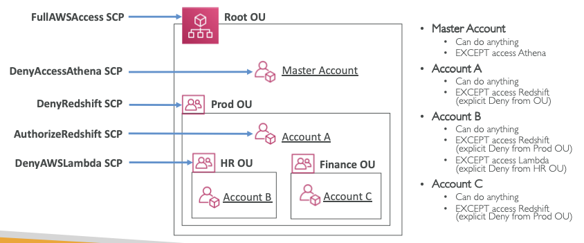

# Organizations

Created By: Keishin CHOU
Last Edited: Apr 28, 2020 4:42 PM

### Overview

- AWS Organizations is an account management service that enables you to consolidate multiple AWS accounts into an organization that you create and centrally manage. AWS Organizations includes account management and consolidated billing capabilities that enable you to better meet the budgetary, security, and compliance needs of your business. As an administrator of an organization, you can create accounts in your organization and invite existing accounts to join the organization.
- Global service.
- The main account is only one, and you can't change it.
- Member accounts can only be part of one organization.

### Service Control Policies

- Service control policies (SCPs) are one type of policy that you can use to manage your organization. SCPs offer central control over the maximum available permissions for all accounts in your organization, allowing you to ensure your accounts stay within your organization’s access control guidelines.
- Whitelist and Blacklist IAM Roles in each organization unit.
- Applied at the Root, organization unit or Account level.
- By default, SCP does not allow anything.
- Use cases:
    - Restrict access to certain services (ex. can't use EMR).

### SCP Hierarchy

