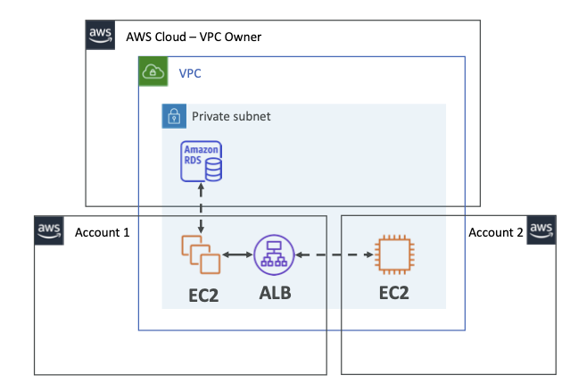

# RAM

Created By: Keishin CHOU
Last Edited: Apr 29, 2020 11:09 AM

### Overview

- AWS Resource Access Manager (AWS RAM) lets you share your resources with any AWS account or through AWS Organizations.
- Benefits
    - **Reduces operational overhead**—Create resources centrally and use AWS RAM to share those resources with other accounts. This eliminates the need to provision duplicate resources in every account, which reduces operational overhead.
    - **Provides security and consistency**—Govern consumption of shared resources using existing policies and permissions, to achieve security and control. AWS RAM offers a consistent experience for sharing different types of AWS resources.
    - **Provides visibility and auditability**—View usage details for shared resources through integration with Amazon CloudWatch and AWS CloudTrail. AWS RAM provides comprehensive visibility into shared resources and accounts.

### Shareable Resources

[Shareable Resources](https://docs.aws.amazon.com/ram/latest/userguide/shareable.html)

- Example: Sharing VPC Subnets
    - allow to have all the resources launched in the same subnet
    - must be from the same AWS Organization
    - cannot share security groups and default VPC
    - participants can manage their own resources, but cannot view, delete, modify resources that belong to other participants or the owner

    

    Anything deployed in the VPC can talk to each other. Applications are accessed across accounts using **Private IP**. Security groups can be **referenced** for maximum security.