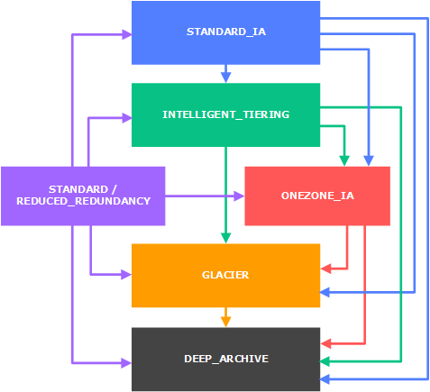

# S3

Created By: Keishin CHOU
Last Edited: Apr 21, 2020 1:50 PM

### Overview

- Bucket
    - Buckets must have a globally unique name.
        - no uppercase
        - no underscore
        - 3-63 characters long
        - start with a lowercase letter or number
    - Buckets are defined at a region level.
- Object
    - Object key is the FULL path of the object

        <my_bucket_name>/my_folder_name/my_file.txt

    - Max size is 5TB
    - If the object is larger than 5GB, you must use "multi-part upload"

### Versioning

- Enabled at bucket level
- Any file that is not versioned prior to enable versioning will have version "null"
- Delete a item means adding a "*delete*" version to this item

### Encryption

- Methods for encryption
    - SSE-S3
        - encrypts S3 objects using keys handled & managed by AWS
        - AES-256 encryption type
        - header: "x-amz-server-side-encryption": "AES256"
    - SSE-KMS
        - leverage AWS Key Management Service to manage encryption keys
        - header: "x-amz-server-side-encryption": "aws:kms"
    - SSE-C
        - manage encryption keys owned by user
        - must use **HTTPS**
    - Client side encryption

### S3 CORS

- Request data from another S3 bucket will need to enable CORS.
- Allow user to limit the number of websites that can request the item in the S3 bucket.

### S3 Consistency

- Read after write consistency for PUTS of new objects.
    - As soon as an object is written, you can retrieve it. ex. PUT 200 → GET 200
    - Except if you did a GET before to see if the object existed. ex. GET 404 → PUT 200 → GET 404 ⇒ eventually consistency
- Eventually consistency for DELETES and PUTS of existing objects.
    - If you read an object right after updating, you might get the older version. ex. PUT 200 → PUT 200 → GET 200 (might old version)
    - If you delete an object, you might still be able to retrieve it for a short time. ex. DELETE 200 → GET 200

### S3 MFA Delete

- You will need MFA to
    - permanently delete an object version
    - suspend versioning on the bucket
- You won't need MFA to
    - enable versioning
    - listing deleted versions
- Only the bucket owner (root account) can enable / disable MFA-Delete.
- MFA-Delete can only be enabled by using the CLI.

### S3 Pre-signed URLs

- You can generate a pre-signed URL for download or upload using SDK / CLI
- Upload URLs must use SDK
- Valid for a default of 3600 seconds. You can change the timeout with —expires-in[TIME_BY_SECONDS] argument.
- User given the pre-signed URL inherits the permissions of the person who generated the URL for GET / PUT.

### S3 Storage Classes

- Standard
- Standard - IA
- One Zone - IA
- Intelligent Tiering
- Glacier
- Glacier Deep Archive

[Storage Classes](S3/Storage%20Classes.csv)

### S3 Lifecycle Policies

- The S3 Standard storage class to any other storage class.
- Any storage class to the S3 Glacier or S3 Glacier Deep Archive storage classes.
- The S3 Standard-IA storage class to the S3 Intelligent-Tiering or S3 One Zone-IA storage classes.
- The S3 Intelligent-Tiering storage class to the S3 One Zone-IA storage class.
- The S3 Glacier storage class to the S3 Glacier Deep Archive storage class.

- Usage examples
    - Access files can be set to delete after 365 days.
    - Can be used to delete old version files. (if versioning is enabled)
    - Can be used to delete incomplete multi-part uploads.
- Rules can be created for a certain prefix. ex. S3://mybucket/mp3/*
- Rules can be created for certain object tags. ex. Department: Finance

### S3 Object Lock & Glacier Vault Lock

- S3 Object Lock
    - Adopt a WORM(Write once read many) model
    - Block an object version deletion for a specific amount of time
    - ⇒ No one can modify the objects.
- Glacier Vault Lock
    - Adopt a WORM(Write once read many) model
    - Objects can't be deleted.
    - Lock the policy for future edits. (Can no longer be changed.)
    - ⇒ No one can delete the objects. Helpful for compliance and data retention.