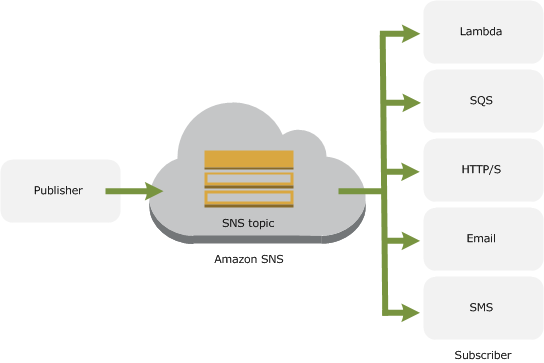

# SNS

Created By: Keishin CHOU
Last Edited: Apr 24, 2020 7:09 PM

### Overview

- Amazon Simple Notification Service
    - Coordinates and manages the delivery or sending of messages to subscribing endpoints or clients.
- Publishers
    - Communicate asynchronously with subscribers by producing and sending a message to a topic
- Topic
    - A logical access point and communication channel.
- Subscribers (web servers, email addresses, Amazon SQS queues, AWS Lambda functions)
    - Consume or receive the message or notification over one of the supported protocols (Amazon SQS, HTTP/S, email, SMS, Lambda) when they are subscribed to the topic.

### SNS + SQS Fanout

- The "fanout" scenario is when an Amazon SNS message is sent to a topic and then replicated and pushed to multiple Amazon SQS queues, HTTP endpoints, or email addresses.
- This allows for parallel asynchronous processing.

### Mobile Push

- With Amazon SNS, you have the ability to send push notification messages directly to apps on mobile devices. Push notification messages sent to a mobile endpoint can appear in the mobile app as message alerts, badge updates, or even sound alerts.