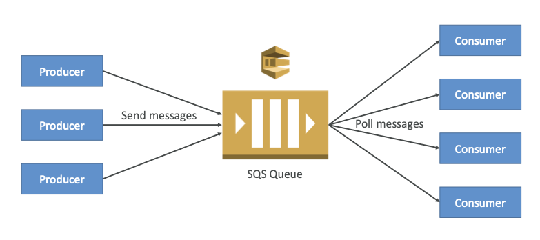

# SQS

Created By: Keishin CHOU
Last Edited: Apr 25, 2020 9:20 AM

### SQS Overview

- Decouple your applications with queue model.
- SQS is automatically scalable.

- Queue types:
    - Standard queue
    - FIFO queue

### Standard Queue

- Feature
    - Unlimited Throughput: Standard queues support a nearly unlimited number of transactions per second (TPS) per API action.
    - At-Least-Once Delivery: A message is delivered at least once, but occasionally more than one copy of a message is delivered.
    - Best-Effort Ordering: Occasionally, messages might be delivered in an order different from which they were sent.

    

- Send data between applications when the throughput is important, for example:
    - Decouple live user requests from intensive background work: let users upload media while resizing or encoding it.
    - Allocate tasks to multiple worker nodes: process a high number of credit card validation requests.
    - Batch messages for future processing: schedule multiple entries to be added to a database.

### FIFO Queue

- Feature
    - High Throughput: FIFO queues support up to 300 messages per second (300 send, receive, or delete operations per second). When you batch 10 messages per operation (maximum), FIFO queues can support up to 3,000 messages per second. To request a limit increase, file a support request.
    - First-In-First-Out Delivery: The order in which messages are sent and received is strictly preserved.
    - Exactly-Once Processing: A message is delivered once and remains available until a consumer processes and deletes it. Duplicates are not introduced into the queue.
    - Optional enable Content-Based Deduplication: Use a SHA-256 hash of the body of the message (but not the attributes of the message) to generate the content-based Message Deduplication ID.

    

- Send data between applications when the order of events is important, for example:
    - Ensure that user-entered commands are executed in the right order.
    - Display the correct product price by sending price modifications in the right order.
    - Prevent a student from enrolling in a course before registering for an account.

### Queue Configuration

- Default Visibility Timeout
    - The length of time (in seconds) that a message received from a queue will be **invisible** to other receiving components.
        - 0 seconds ~ 12 hours. Default 30 seconds.
        - If too high (15 minutes) and the first consumer fails to process the message, you must wait a long time before processing the message again.
        - If too low (30 seconds) and the first consumer needs time to process the message (2 minutes), another consumer will receive the message and the message will be processed more than once.
    - APIs
        - ChangeMessageVisibility: change the visibility time while processing a message.
        - DeleteMessage: tell SQS the message was successfully processed and it's OK to be deleted.
- Message Retention Period
    - The amount of time that Amazon SQS will retain a message if it does not get deleted.
        - 1 minute ~ 14 days. Default 4 days.
- Maximum Message Size
    - Maximum message size (in bytes) accepted by Amazon SQS.
        - 1 KB ~ 256KB. Default 256KB.
- Delivery Delay
    - The amount of time to delay the first delivery of all messages added to this queue.
        - 0 seconds ~ 15 minutes. Default 0 seconds.
- Receive Message Wait Time
    - When a consumer requests message from the queue, it can optionally wait for messages to arrive if there are none in the queue. Long polling makes the server side waiting if there is no messages. Short polling makes the server sending a response even there is no messages.
    - The maximum amount of time that a **long polling** receive call will wait for a message to become available before returning an empty response.
        - Long Polling: Decrease the number of API calls made to the SQS while increasing the efficiency and latency of your application.
        - Long polling is preferable to Short polling.
        - 0 seconds (short polling) ~ 20 seconds (long polling). Default 0 seconds.
    - Short polling: Consumer queries only a subset of the servers to find messages that are available to include in the response. Amazon SQS sends the response right away, even if the query found no messages.
    - Long polling: Consumer queries all of the servers for messages. Amazon SQS sends the response after it collects the maximum number of messages for the response, or when the ReceiveMessage polling wait time expires.
        - Eliminate empty responses by allowing Amazon SQS to wait until a message is available in a queue before sending a response. Unless the connection times out, the response to the `ReceiveMessage` request contains at least one of the available messages, up to the maximum number of messages specified in the `ReceiveMessage` action.
        - Eliminate false empty responses by querying all—rather than a subset of—Amazon SQS servers.
- Dead Letter Queue
    - If a consumer failed to process a message within the Visibility Timeout, the message goes back to the Queue. The *receiveCount* variable of that message +1. You can define a  *maxReceiveCount* value which means how many times a message can go back to the queue - Redrive Policy. When the *receiveCount* exceeds the *maxReceiveCount* value, the message goes into a Dead Letter Queue.
    - You have to create a queue first, and designate it to be a Dead Letter Queue.
    - The dead-letter queue of a FIFO queue must also be a FIFO queue. Similarly, the dead-letter queue of a standard queue must also be a standard queue.
    - Dead-letter queue and the original queue must use a same account, and must be in a same Region.
    - The expiration of a message is always based on its original enqueue timestamp. When a message is moved to a dead-letter queue, the enqueue timestamp remains **unchanged**.
        - For example, if a message spends 1 day in the original queue before being moved to a dead-letter queue, and the retention period of the dead-letter queue is set to 4 days, the message is deleted from the dead-letter queue after 3 days.
        - It is a best practice to always set the retention period of a dead-letter queue to be longer than the retention period of the original queue.
    - Don’t use a dead-letter queue with a FIFO queue if you don’t want to break the exact order of messages or operations. For example, don’t use a dead-letter queue with instructions in an Edit Decision List (EDL) for a video editing suite, where changing the order of edits changes the context of subsequent edits.

### Use SQS with Auto Scaling Group (ASG)

### SQS to decouple between application tiers

